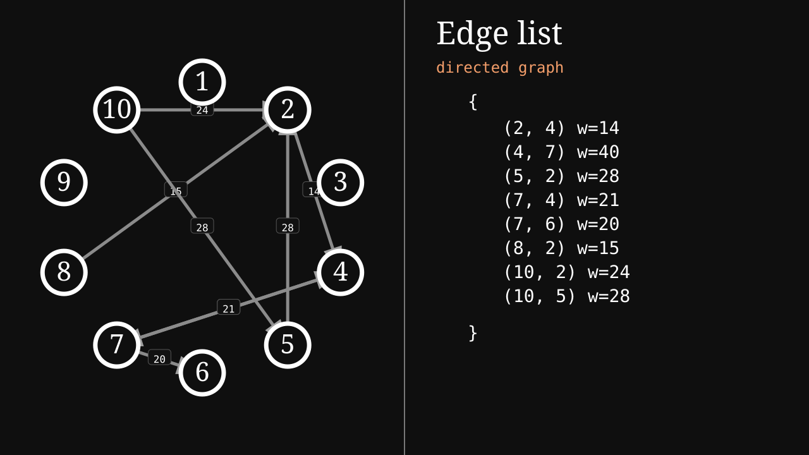

# Graph Algorithm Visualizer

A compact C++17 project for working with graph representations and classic graph algorithms from the command line. The codebase is organized with separate headers and source files, following a small modular layout similar to data-structure and algorithm study projects.

## Features

- Adjacency matrix representation for directed and undirected graphs
- Manual matrix entry from the terminal
- Random weighted matrix generation with configurable density
- Built-in sample graph for quick testing
- Graph property report:
  - vertex count
  - edge count
  - directed or undirected type
  - weighted or unweighted type
  - loop detection
  - vertex degrees
- Depth-first search
- Breadth-first search
- Topological sort with cycle detection
- Kruskal minimum spanning tree
- Prim minimum spanning tree
- Dijkstra shortest paths
- Bellman-Ford shortest paths with negative-cycle detection
- Graphviz `.dot` export for graph and tree visualization
- Native SVG export with graph layout and edge-list panel
- Optional PNG export when Graphviz is installed
- ANSI terminal interface with framed command panels

## Project Structure

```text
.
├── include/
│   ├── base.h
│   └── graph/
│       ├── algorithms.h
│       ├── graph.h
│       └── viz.h
├── src/
│   ├── main.cpp
│   └── graph/
│       ├── algorithms.cpp
│       ├── graph.cpp
│       └── viz.cpp
├── Makefile
└── README.md
```

## Build

```bash
make
```

The executable is created at:

```bash
./build/main
```

Clean build artifacts:

```bash
make clean
```

## Run

```bash
./build/main
```

Input modes:

```text
1 - Use sample matrix
2 - Enter matrix manually
3 - Generate random matrix
```

After creating a graph, choose an operation:

```text
info
viz
dfs
bfs
topo
kruskal
prim
dijkstra
bellman
all
exit
```

`viz` writes `output/graph.svg` and `output/graph.dot`. If Graphviz is installed, it also writes `output/graph.png`.

## Matrix Input

For manual input, enter the number of vertices and then each matrix cell. Use `0` when no edge exists. Negative weights are accepted, which allows Bellman-Ford examples.

Example for an undirected weighted graph with five vertices:

```text
 0  9 75  0  0
 9  0 95 19 42
75 95  0 51 66
 0 19 51  0 31
 0 42 66 31  0
```

For undirected graphs, the program normalizes asymmetric input by using the upper-triangle value for each pair.

## Visualization



The application writes visualization files for supported operations:

```text
output/graph.svg
output/graph.dot
output/graph.png
output/kruskal.dot
output/kruskal.svg
output/prim.dot
output/prim.svg
```

`output/graph.svg` is generated directly by the application and contains a split view: graph drawing on the left and an edge-list panel on the right. Render a `.dot` file to PNG manually with Graphviz:

```bash
dot -Tpng output/graph.dot -o output/graph.png
```

## License

This project is available under the [MIT License](LICENSE).
